# API

`finance-plots` exposes plotting and table helpers at the package root:

```python
from finance_plots import (
    plot_returns,
    plot_rolling_returns,
    plot_rolling_volatility,
    plot_rolling_sharpe,
    plot_rolling_beta,
    plot_rolling_correlation,
    plot_return_scatter,
    plot_drawdown_underwater,
    plot_returns_heatmap,
    plot_returns_bar,
    plot_returns_dist,
    plot_returns_timeseries,
    plot_indicator_panel,
    plot_price_with_overlays,
    perf_stats,
    table_perf_stats,
    table_period_returns,
    table_drawdowns,
)
```

Plots accept Narwhals-compatible one-dimensional inputs such as pandas Series,
Polars Series, numpy arrays, and other supported backends. Plot functions return
`matplotlib.figure.Figure`. Table helpers either return a Python dictionary or a
`great_tables.GT` object.

______________________________________________________________________

## Return and Risk Plots

### `plot_returns(returns, live_start=None, log_scale=False, ax=None)`

Cumulative strategy returns without requiring a benchmark argument.

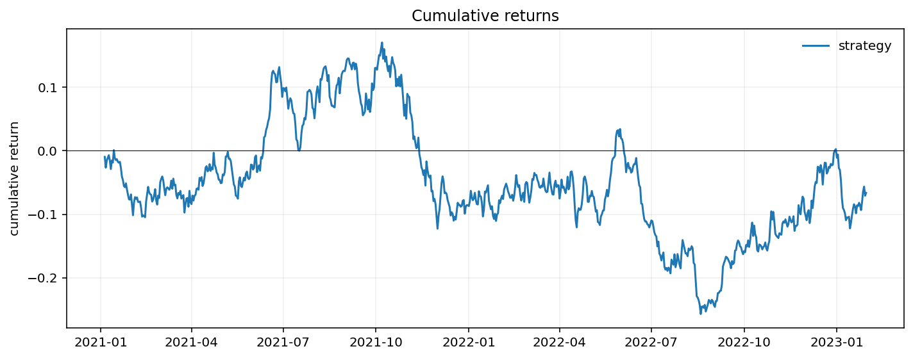

### `plot_rolling_returns(returns, benchmark=None, live_start=None, log_scale=False, ax=None)`

Cumulative strategy returns with optional benchmark and out-of-sample shading.

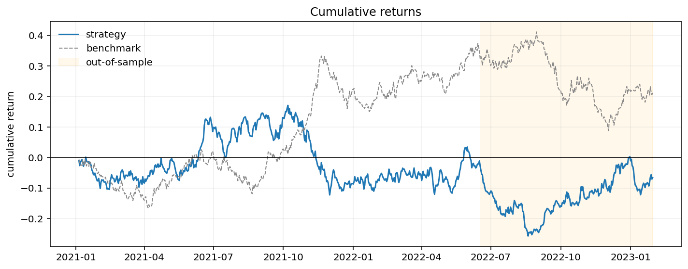

### `plot_rolling_volatility(returns, window=63, periods_per_year=252, ax=None)`

Rolling annualized volatility.

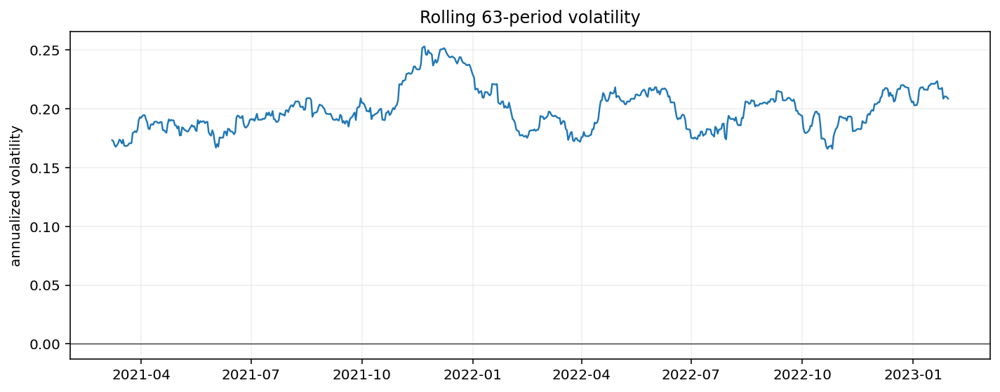

### `plot_rolling_sharpe(returns, window=63, periods_per_year=252, ax=None)`

Rolling annualized Sharpe ratio.

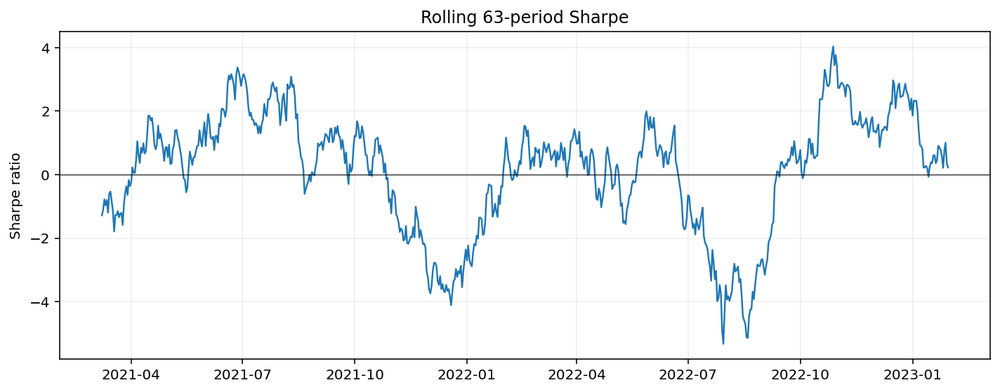

### `plot_rolling_beta(returns, benchmark, window=63, ax=None)`

Rolling beta versus a benchmark return series.

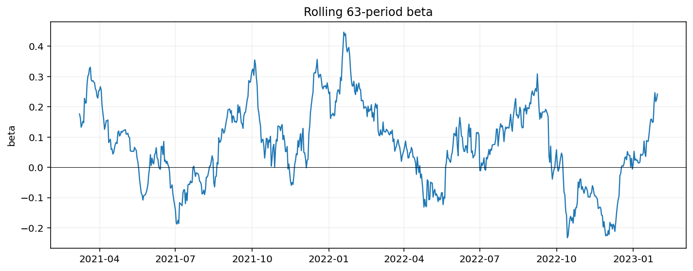

### `plot_rolling_correlation(returns, benchmark, window=63, ax=None)`

Rolling correlation versus a benchmark return series.

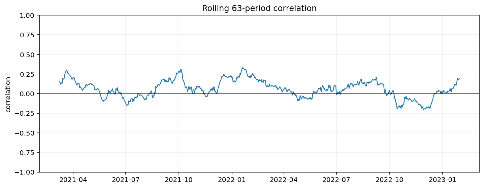

### `plot_return_scatter(returns, benchmark, ax=None)`

Strategy returns plotted against benchmark returns with a fitted beta line.

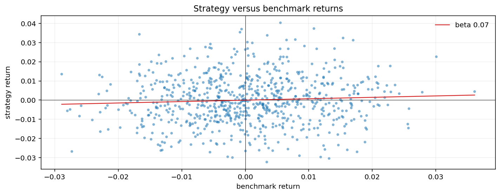

### `plot_drawdown_underwater(returns, ax=None)`

Underwater drawdown chart built from compounded returns.

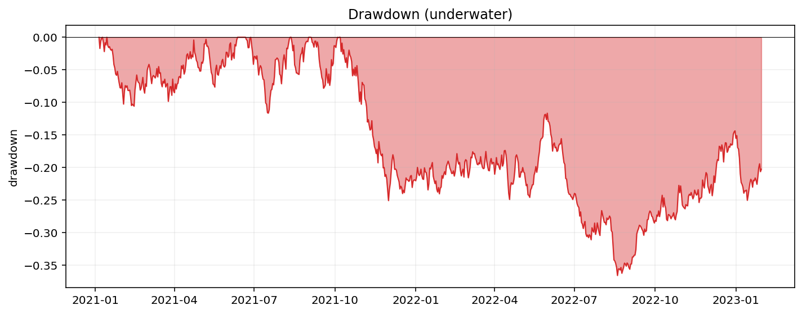

### `plot_returns_heatmap(returns, period="month", ax=None)`

Calendar return heatmap for month, quarter, or week buckets.

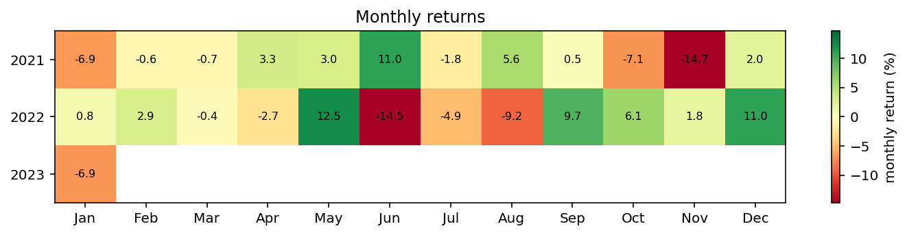

### `plot_returns_bar(returns, period="year", ax=None)`

Compounded period returns as a bar chart.

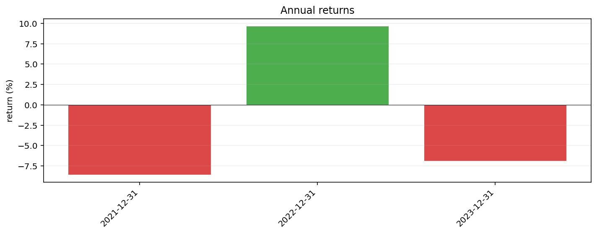

### `plot_returns_dist(returns, period="month", bins=20, ax=None)`

Distribution of compounded period returns.

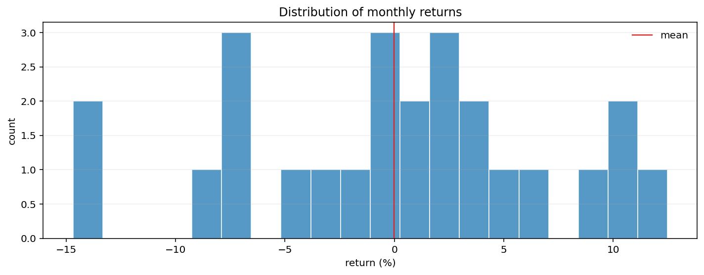

### `plot_returns_timeseries(returns, period="month", ax=None)`

Compounded period returns through time.

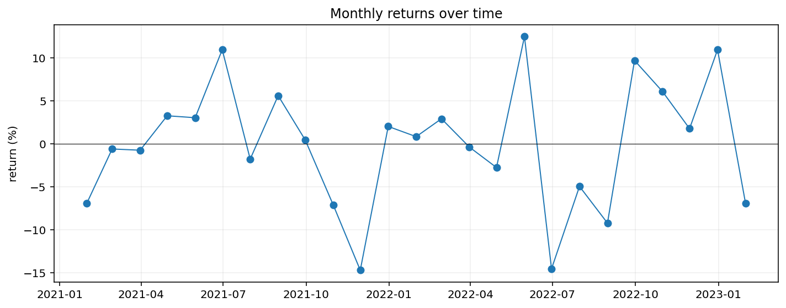

## Technical Indicator Plots

### `plot_price_with_overlays(price, overlays=None, secondary_overlays=None, secondary_ylabel=None, figsize=(10.0, 4.0), title=None)`

Price line with same-axis overlays and optional right-axis indicators such as RSI.

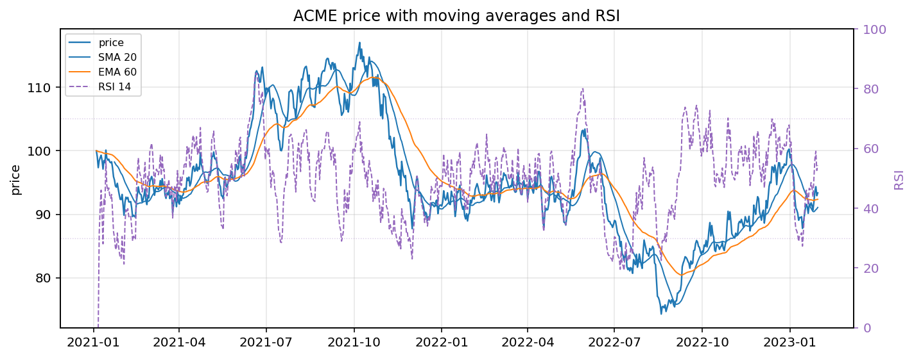

### `plot_indicator_panel(price, panels=None, figsize=None, title=None)`

Price chart with configurable aligned indicator sub-panels.

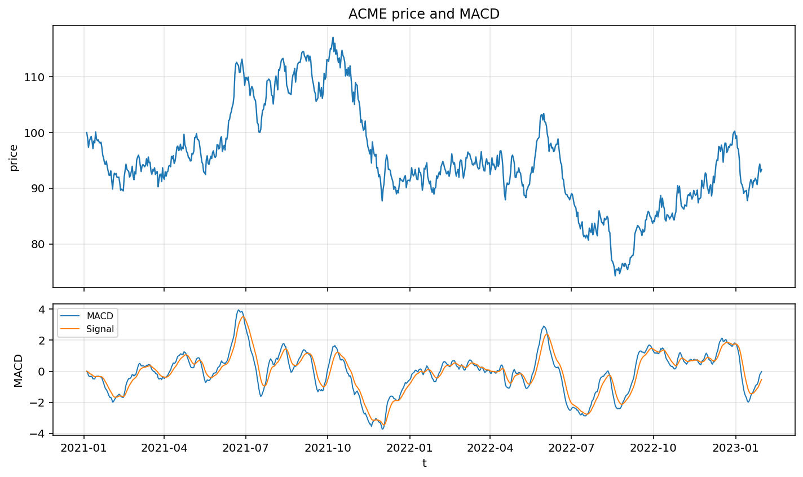

## Performance Tables

### `perf_stats(returns, periods_per_year=252)`

Compute scalar performance statistics.

```{include} ../assets/gallery/perf_stats.md
```

### `table_perf_stats(returns, benchmark=None, periods_per_year=252)`

Build a Great Tables performance summary.

```{include} ../assets/gallery/table_perf_stats.md
```

[table_perf_stats.html](../assets/gallery/table_perf_stats.html)

### `table_period_returns(returns, period="year")`

Build a Great Tables table of compounded period returns.

```{include} ../assets/gallery/table_period_returns.md
```

### `table_drawdowns(returns, top=5)`

Build a Great Tables table of the largest drawdown periods.

```{include} ../assets/gallery/table_drawdowns.md
```

## Example Artifact Helper

| Function                                                                   | Description                                              |
| -------------------------------------------------------------------------- | -------------------------------------------------------- |
| `finance_plots.gallery.generate_gallery(output_dir="docs/assets/gallery")` | Write one example artifact per current public plot/table |

______________________________________________________________________

## Reference

```{eval-rst}
.. currentmodule:: finance_plots

.. autofunction:: plot_returns

.. autofunction:: plot_rolling_returns

.. autofunction:: plot_rolling_volatility

.. autofunction:: plot_rolling_sharpe

.. autofunction:: plot_rolling_beta

.. autofunction:: plot_rolling_correlation

.. autofunction:: plot_return_scatter

.. autofunction:: plot_drawdown_underwater

.. autofunction:: plot_returns_heatmap

.. autofunction:: plot_returns_bar

.. autofunction:: plot_returns_dist

.. autofunction:: plot_returns_timeseries

.. autofunction:: plot_price_with_overlays

.. autofunction:: plot_indicator_panel

.. autofunction:: perf_stats

.. autofunction:: table_perf_stats

.. autofunction:: table_period_returns

.. autofunction:: table_drawdowns


.. currentmodule:: finance_plots.gallery

.. autofunction:: generate_gallery
```
